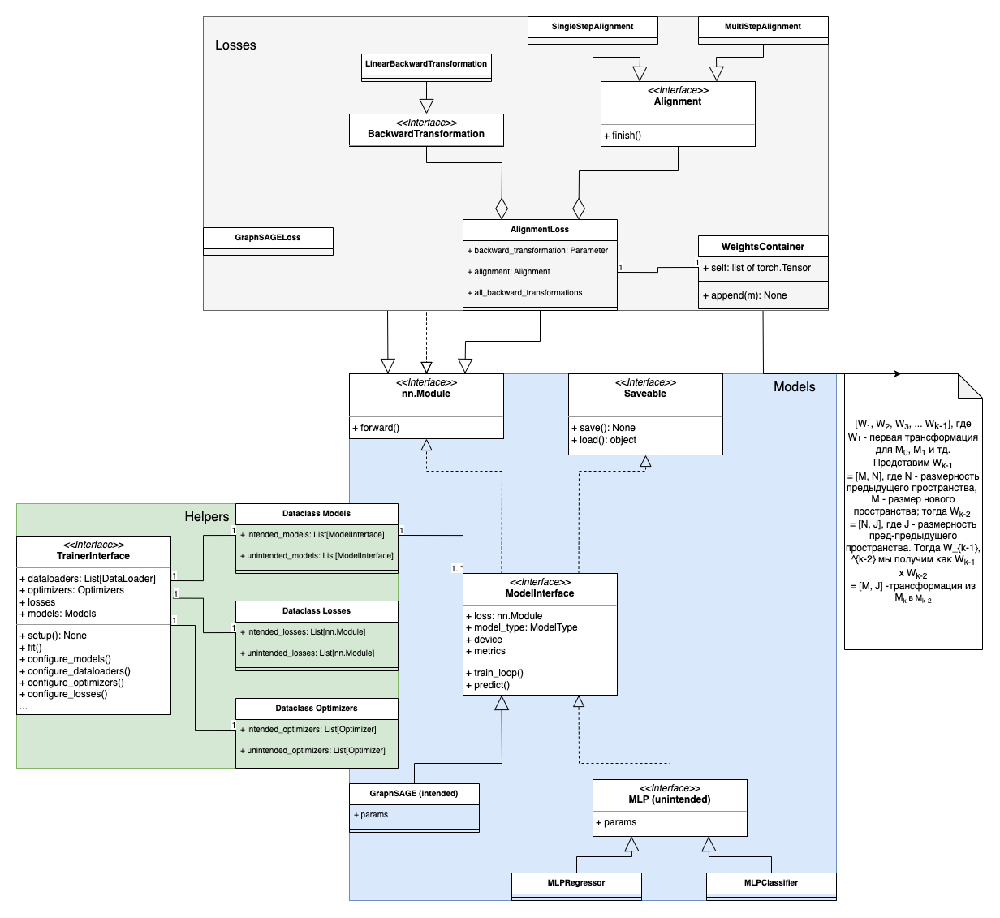

# Studying Backward Compatible Embeddings
A repository created for studying different aspects of [Backward Compatible Embeddings](https://arxiv.org/abs/2206.03040)
DL architecture for machine learning tasks.
## Problem formulation
**Problem formulation** can be found in the original paper repository [bc-emb](https://github.com/snap-stanford/bc-emb).
## Modules
`src` contains several main modules:
1. `containers`
   1. `WeightsContainer` - module for **Backward Transformation** storage.
2. `dataclasses` - several helpers to deal with many _intended/unintended_ models.
3. `interfaces` - main interfaces to inherit from
   1. `ModelInterface`
   2. `Saveable`
   3. `TrainerInterface`
4. `losses` - different useful losses.
   1. `GraphSAGELoss` - loss for unsupervised embeddings learning on graphs as described in [paper](https://arxiv.org/pdf/1706.02216.pdf).
   2. `AlignmentLoss` - loss for alignment of different embeddings that has its own state and should be optimized.
   3. `BackwardTransformation` - backward transformation for embeddings.
5. `models`
   1. `intended`
      1. `GraphSAGE`
   2. `unintended`
      1. `MLP`
6. `trainers`
   1. `TwoStageTrainer` - for training of intended/unintended models in unified manner.
7. `tests`
8. `utils`
## Classes Diagram

## Reproducibility
For now there is only `requirements` and `Dockerfile`. First can be used for reproducing locally,
second can be started with `build.sh`, `build_test.sh` scripts.
**Important:** work is in progress.

